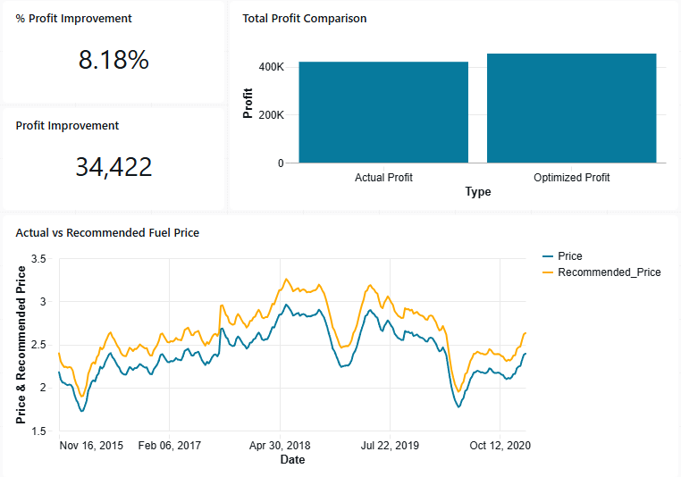

# Dynamic Fuel Pricing Optimization using Machine Learning

## Business Problem  
Fuel retailers often rely on static pricing rules or competitor matching strategies, which may not maximize profitability. Because fuel demand is price-sensitive and seasonally driven, small pricing adjustments can significantly impact weekly revenue and profit.

## Key Question  
How can we use machine learning to forecast fuel demand and determine the profit-maximizing price each week?

## Impact  
This project demonstrates that a data-driven dynamic pricing strategy can significantly outperform historical pricing decisions. In backtesting, the optimized strategy increased total profit by over **$107,000** compared to baseline pricing across the test period.

---

# Project Overview

This project builds an end-to-end **dynamic pricing engine** that:

1. Models price elasticity of fuel demand  
2. Forecasts weekly demand using time-series machine learning  
3. Optimizes prices to maximize profit  
4. Backtests the strategy against historical pricing  

The system combines economic modeling with ML-based forecasting to simulate real-world fuel pricing decisions.

Two implementations are included:

- **Local Python workflow:** Pandas, Scikit-learn, XGBoost, Matplotlib (for prototyping and analysis)  
- **Databricks workflow:** PySpark, SQL, Databricks notebooks, and interactive dashboards (for enterprise-scale, distributed processing)

---

# Dataset

- **Source:** U.S. Weekly Retail Gasoline Prices (1995–2021)  
- Focused on Regular gasoline price series (`R1`)  
- Frequency: Weekly  

Synthetic demand was generated to simulate realistic price-sensitive consumer behavior.

---

# Methodology

## Elasticity Modeling

A linear regression model was used to estimate price sensitivity:

Demand = f(Price, Lagged Prices, Rolling Averages)

**Result:**
- Price coefficient ≈ **-168**
- Interpretation: A $1 increase in price reduces weekly demand by ~168 units.

This confirms expected negative price elasticity.

---

## Feature Engineering

To convert time-series data into supervised learning format:

- Lag features (Price_lag1, Price_lag2)  
- Rolling averages (3-week, 5-week)  
- Seasonal features (Month, Week of Year)

These features capture short-term momentum and seasonal patterns.

---

## Time-series Demand Forecasting (XGBoost)

- Model: XGBoost Regressor  
- Train/Test Split: Time-based (no data leakage)  

**Performance:**
- RMSE ≈ 22 units  
- MAPE ≈ 1.83%  

The model accurately predicts weekly fuel demand given price and historical trends.

---

## Profit Optimization Engine

For each week in the test set:

1. Generate 50 possible prices (±20% around current price)  
2. Predict demand at each candidate price  
3. Compute profit:

Profit = (Price - Cost) × Predicted Demand

4. Select price that maximizes profit  

**Dynamic cost assumption:**
Cost = ActualPrice - 0.30

---

# Backtesting Results

| Metric | Value |
|--------|-------|
| Total Actual Profit | $78,778 |
| Total Optimized Profit | $185,913 |
| Total Profit Improvement | **$107,135** |

The optimized strategy significantly outperformed historical pricing decisions.

---

# Visualizations & Dashboard

- Fuel demand vs. predicted demand (line chart)  
- Actual vs. optimized profit (bar chart)  
- % Profit Improvement (single-value KPI)  

Interactive **Databricks dashboard**: [View Dashboard](https://dbc-8f741bd9-c6d4.cloud.databricks.com/dashboardsv3/01f110740f2e18909f335cc5304f9a05/published?o=7474660378651724)  

---

# Tech Stack

- Python, Pandas, NumPy, Scikit-learn, XGBoost, Matplotlib (local workflow)  
- PySpark, SQL, Databricks Notebooks, Databricks Dashboards (distributed workflow)  

---

# Business Relevance

This project demonstrates how data science can directly support retail pricing strategy by combining:

- Econometrics (Elasticity Modeling)  
- Machine Learning (Demand Forecasting)  
- Optimization (Profit Maximization)  
- Backtesting (Strategy Validation)  

It simulates a real-world decision-support system used in fuel retail and convenience store operations.
